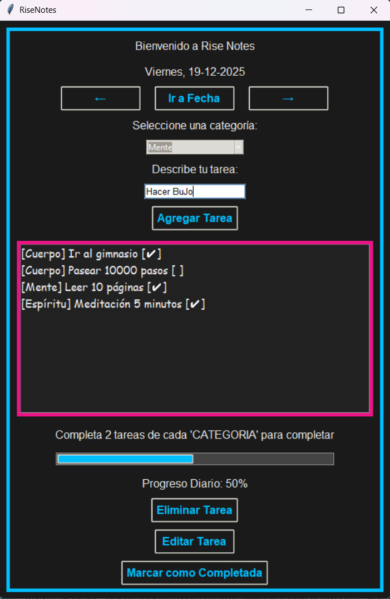
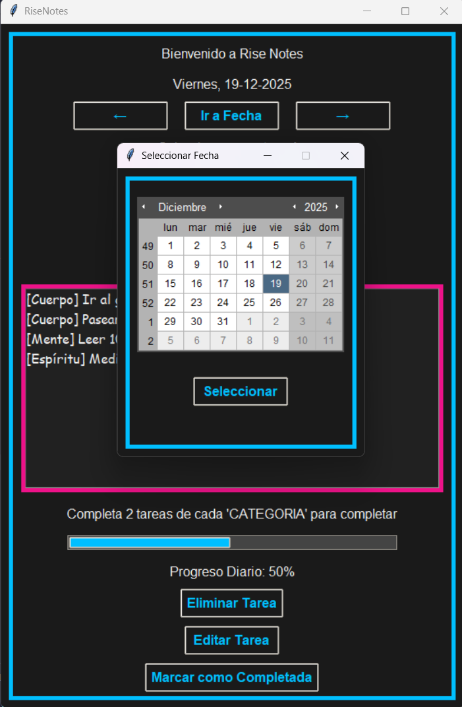

# RiseNotes

## RiseNotes Gestor de Tareas en Python
Esta aplicación es un trabajo de fin de grado realizado para el instituto Online Ilerna.

Se trata de una aplicación sencilla que permite registrar tareas y marcarlas según tres categorías distintas: Mente, Cuerpo y Espíritu.

Además cuenta con un selector de fechas y una barra de progreso para intentar añadir tareas de todas las categorías para mantener el equilibrio.
___

### Estructura de la aplicación:

RiseNotes/
├── baseDatos.py
├── controladorRiseNotes.py
├── main.py
├── modeloRiseNotes.py
├── vistaRiseNotes.py
└── README.md

___

### Descripción de los módulos

- main.py
Ejecuta la parte principal de la aplicación.
- modeloRiseNotes.py
Contiene toda la lógica de negocio: gestión de tareas, categorías y validaciones.
- vistaRiseNotes.py
Incluye la interfaz visual de la aplicación.
- controladorRiseNotes.py
Actúa como intermediario entre el modelo y la vista, coordinando la interacción entre ambos.
- baseDatos.py
Define la estructura y operaciones de la base de datos utilizada por la aplicación

___

### Capturas de la interfaz

___

### Uso de la aplicación

- Podemos navegar entre dias con las flechas de la aplicación o seleccionar un dia concreto con el selector.
- Después seleccionamos una categoría, si no se selecciona ninguna salta error indicándolo.
- Describimos la tarea y presionamos botón de agregar o presionamos enter.
- La barra se actualiza dependiendo del número de tareas completadas hasta llegar al 100% que son 2 de cada categoría.
- Podemos tanto eliminar como editar o completar una tarea.

___

### Librerías usadas en el proyecto

- Python en general como lenguaje principal.
- Tkinter para la interfaz.
- Tkcalendar para el selector de fecha.
- SQLite para la base de datos.

___

### Cómo ejecutar el proyecto

git clone <https://github.com/dldevtech/RiseNotes>
cd RiseNotes
python main.py